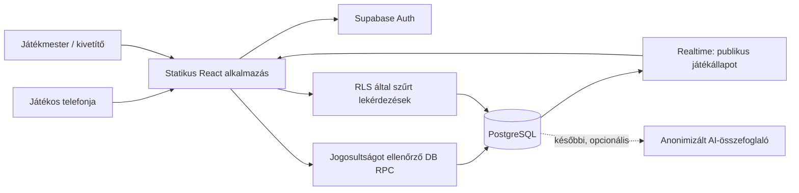
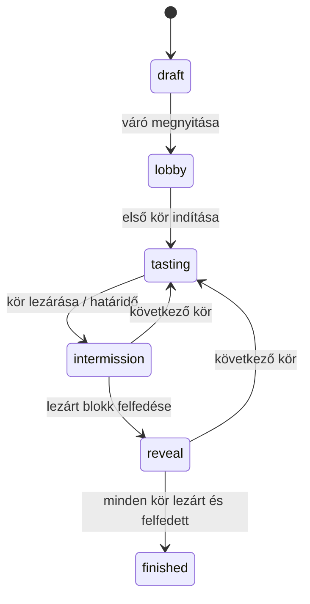

# Architektúra

## Választás

React + TypeScript + Vite egyetlen frontendben, Supabase Auth + PostgreSQL +
Realtime háttérrel. Statikus Cloudflare Pages telepítés; más statikus tárhelyre
is hordozható. SEO és szerveroldali HTML-renderelés nem kritikus a privát játékhoz,
ezért induláskor nem szükséges Next.js vagy külön Node-szerver. Nincs Redis,
mikroszolgáltatás, kötelező konténer vagy futásidejű LLM.

## Rétegek a kódban

- `src/app/`: alkalmazásbelépési pont, kezdőlap, közös keret és útvonalválasztás.
  React Router kezeli a `/`, `/demo`, `/host`, `/auth/callback` útvonalakat.
  A demo dinamikus importtal külön JS-csomagba kerül; a kezdőlap nem tölti le
  a mintaborokat. Ez betöltési határ, nem biztonsági védelem: a demo csomagja publikus.
- `src/auth/`: lazy betöltött hostfelület, PKCE-callback és Reacttól független
  munkamenet-kezelő. Egy Supabase-kliens/böngészőlap; szerverrel ellenőrzött user,
  Auth-események, visszatérés, időkorlát és késői válaszok elleni védelem.
- `src/domain/`: keretrendszertől független validáció, pontozás, állapotgép.
- `src/demo/`: csak a helyi demonstráció adatai és React-felülete.
- `src/lib/`: publikus konfiguráció validálása és az Auth által használt kliensgyár.
  Generált DB-típusok és játékadat-adapter a következő, `create_game` egységben készülnek.
- `src/ai/`: kikapcsolt, szolgáltatófüggetlen összefoglaló-szerződés.
- `supabase/migrations/`: verziózott adatmodell, jogosultság, DB-műveletek.
- `tests/`: domain- és PostgreSQL/RLS-regressziók.
- `docs/`, `memory/`, `skills/`: dokumentált döntések és fejlesztési folytonosság.

## Állapotgép

Az aktív kör saját állapota `pending → open → closed → revealed`.
Egy játékhoz legfeljebb egy `open` kör tartozhat. A DB részleges egyedi indexe
akkor is védi ezt, ha két hostfül egyszerre indítana kört. A további állapot-RPC-k
tranzakcióban zárolják a játékot, majd a kört (mindenhol azonos zársorrend).
A hostparancsok várható `version`-t kapnak az elavult vezérlők kiszűrésére.

## Időzítés és megbízhatóság

`closes_at` UTC időpont az adatbázisban. A válaszfüggvény sorzár megszerzése
után `clock_timestamp()`-pel ellenőriz, nem a telefon órájára támaszkodik.
Lejáratkor a beküldés akkor is tiltott, ha a host nincs csatlakozva.
A tartós `closed` állapotot a következő hostművelet normalizálja; a UI a
határidő alapján már lejártnak mutatja. Nem kell másodpercenkénti szervercron.

Élesítéskor snapshot RPC szolgáltat `server_now` értéket; a kliens ehhez
szinkronizálja a visszaszámlálást. Hálózati újracsatlakozás, lapfókusz és
Realtime-esemény új snapshotot kér. A háttérbe tett telefon nem maradhat régi körön.
Beküldések versengése az upsert és a körzár miatt sorosítható; ismételt kérés
nem készít duplikált választ. Hostparancsokhoz a következő fázisban request ID
és egyedi auditkulcs védi az ismétlést.

## Titkosság

A `rounds` nem tartalmaz valós boradatot. A `wine_secrets` csak a hostnak
olvasható, a `revealed_wines` felfedéskor kitöltött, már publikus pillanatkép.
Csak tagsággal rendelkező felhasználók olvasnak játékállapotot. Mások válaszai
csak felfedett körnél olvashatók. Host számára induláskor csak a saját
válasz lenne olvasható; a beadottsági számláló külön aggregált RPC feladata.

A QR meghívó tokenjét a backend ellenőrzi, a tárolt változat hash. A `join_game`
RPC-ről és rate limitről külön implementáció szükséges. Az éles kliens minden
módosítást korlátozott RPC-n végez, táblák közvetlen módosítására nincs grant.

## Ami most szándékosan előkészítés

Az első migráció nem teljes játékbackend: nincs create/join/start/reveal/finish RPC,
éles QR, Realtime-előfizetés vagy hosztolás. A host Auth és OAuth callback már
elkészült, beállítása és integrációs ellenőrzése a [belépési útmutatóban](auth.md).
A hiányzó műveleteknél nem
publikálunk működőnek látszó, jogosultságot megkerülő ideiglenes API-t.
Az adatmodell és a submit_rating függvény már futtatható és tesztelhető alap.

Források: [Vite](https://vite.dev/guide/),
[Supabase RLS](https://supabase.com/docs/guides/database/postgres/row-level-security),
[DB-függvények](https://supabase.com/docs/guides/database/functions),
[Realtime](https://supabase.com/docs/guides/realtime/postgres-changes).
